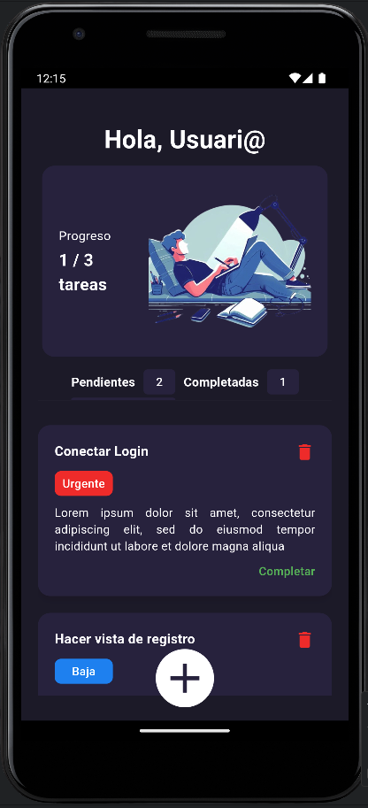

# To-Do List

This application is a To-Do List developed in Flutter that allows users to manage their tasks in a simple and efficient way. It includes functionality to perform create, read and delete operations, and uses an architecture pattern based on BLoC (Business Logic Component) to manage the business logic and maintain a clear separation between the interface and the logic. It also saves tasks even when the application is closed.



## Installation Instructions

1. **Clone the Repository**  
   Clone this repository to your local machine using the following command:
   ```bash
   git clone <repository-url>
    ```
   
2. **Get Packages**  
   Get the packages used in the project by running the following command in the project directory:
   ```bash
   flutter pub get
   ```

3. **Run the Application**
    Run the application using the following command:
    ```bash
    flutter run
    ```


